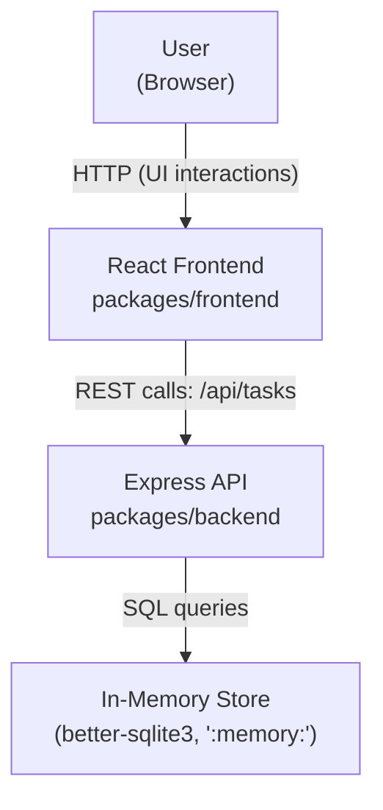
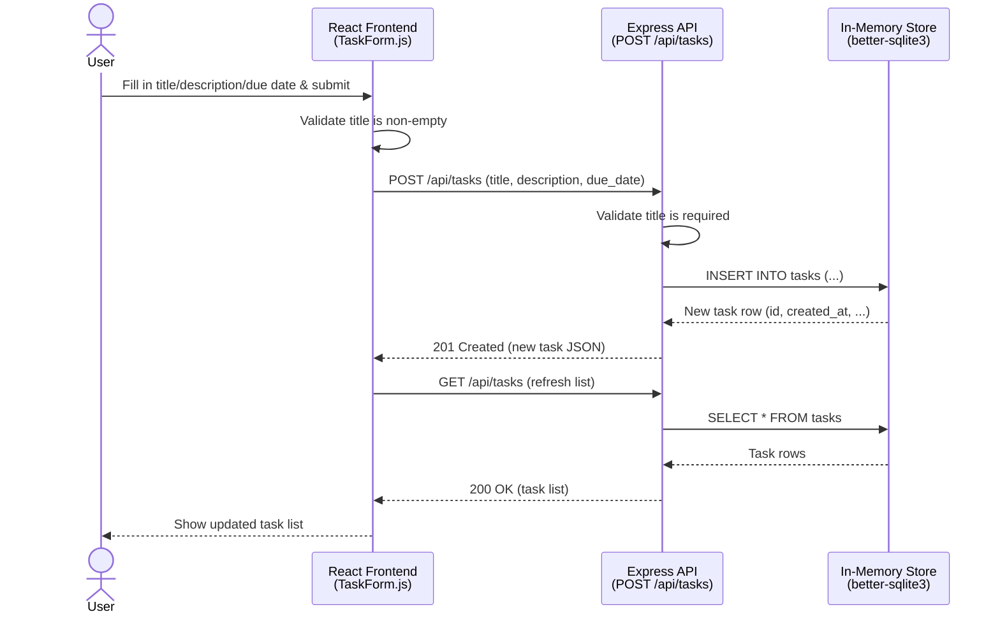

# Cloud Architecture Overview

## System Context

The application is a monorepo consisting of a React frontend and an Express.js backend API, backed by an in-memory data store. There is no external database or cloud storage in the current architecture.

## Components

- **React Frontend** (`packages/frontend`): Renders the TODO UI and calls the backend REST API for all task operations (create, read, update, delete).
- **Express API** (`packages/backend`): Exposes `/api/tasks` endpoints and handles request validation, filtering, and sorting logic.
- **In-Memory Store**: A `better-sqlite3` database instantiated with `:memory:`, scoped to the lifetime of the running backend process. Data does not persist across server restarts and no external database or cloud service is used.

## Sequence: Creating a TODO

